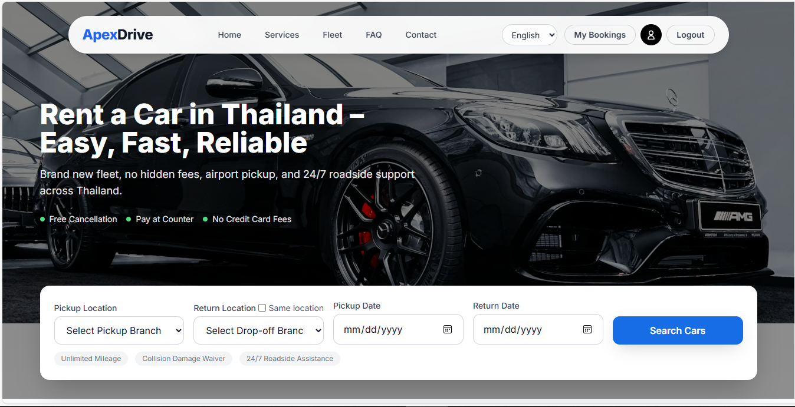
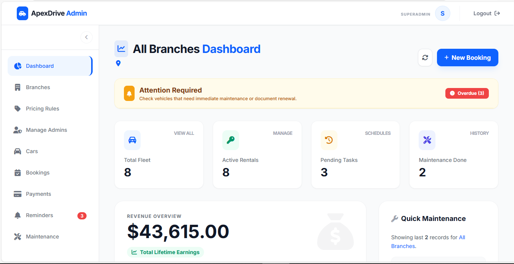
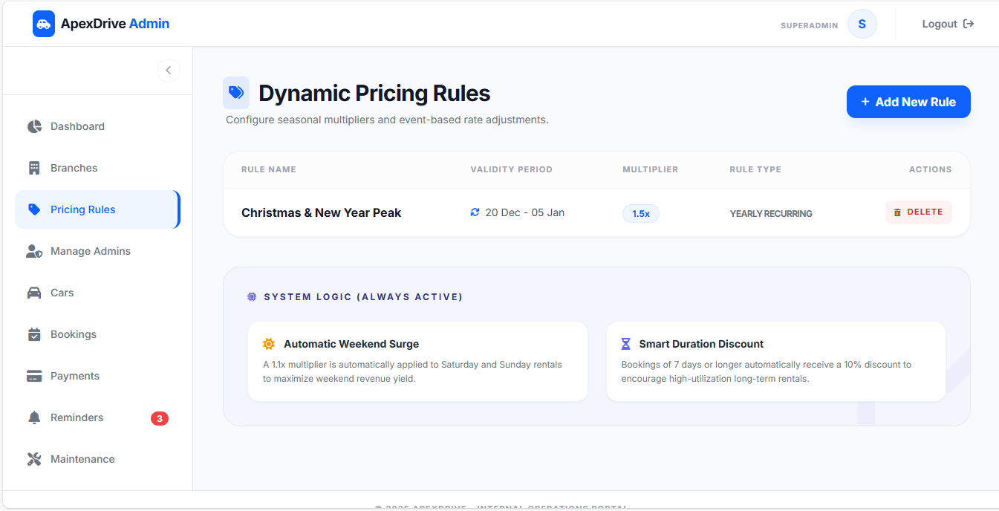
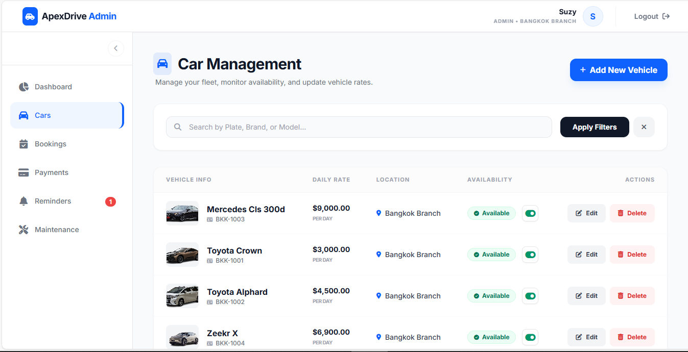

# ApexDrive – Vehicle Rental Management System

## 📌 Project Overview
A web-based vehicle rental management system developed using **ASP.NET Core MVC**.  
The system allows customers to browse and rent vehicles, while admins manage vehicles, bookings, users, and reports through an admin dashboard.

This project was developed as part of my academic and portfolio work to demonstrate real-world system design and full-stack development skills.

---

## 🛠 Technologies Used
- ASP.NET Core MVC (C#)
- Microsoft SQL Server
- Entity Framework Core
- ASP.NET Identity (Authentication & Authorization)
- HTML, CSS, Bootstrap / Tailwind CSS
- Git & GitHub

---

## ✨ Key Features
### Customer
- User registration & login
- Browse available vehicles
- Vehicle booking
- View booking history

### Admin / Super Admin
- Role-based access control
- Manage vehicles (CRUD)
- Manage bookings
- Manage users & admins
- Dashboard overview

---

## 🔐 Demo Accounts (For Testing Only)

| Role          | Email                      | Password   |
|---------------|----------------------------|------------|
| Super Admin   | superadmin@apexdrive.com   | Admin@123  |
| Branch Admin  | apexadmin@bkk.com          | Admin@123  |

⚠️ These demo accounts are created for **testing and evaluation purposes only**.  
🛡 In a production environment, default credentials would be disabled.

---

## 📸 Screenshots

### 🔹 Homepage


### 🔹 Customer Dashboard


### 🔹 Super Admin Dashboard


### 🔹 Branch Admin Dashboard


### 🔹 Booking Management


### 🔹 Dynamic Pricing


### 🔹 Vehicle Management


> 📌 Screenshots are stored in the `/screenshots` folder.

---

## 🚀 How to Run the Project Locally

1. Clone the repository:
   ```bash
   git clone https://github.com/Snape-bur/ApexDrive.git
2. Open the solution in Visual Studio

3. Update the database connection string in:
   appsettings.json
   
5. Apply database migrations:
   Update-Database

5. Run the project
